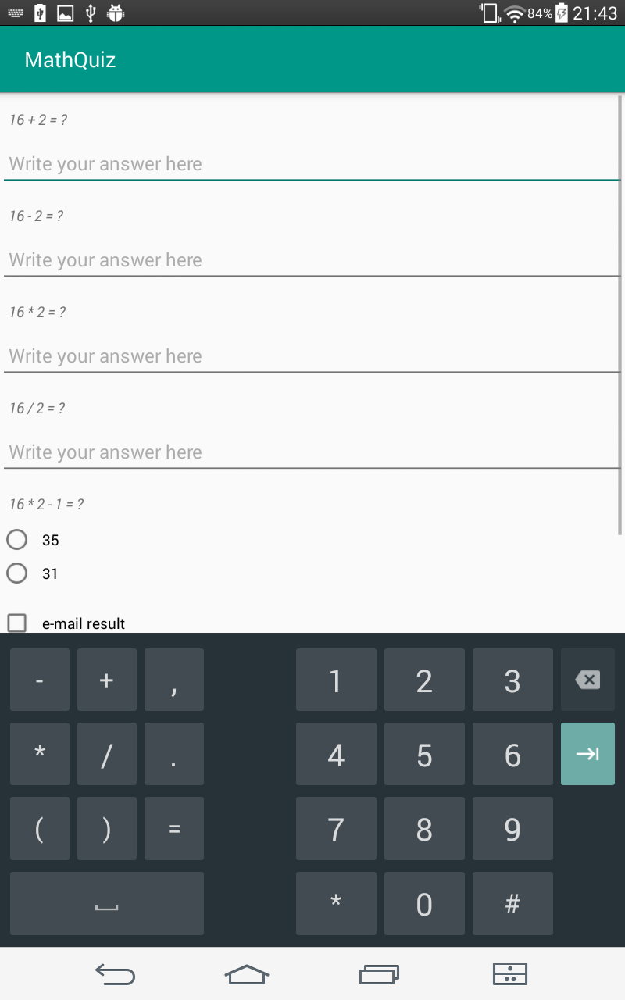
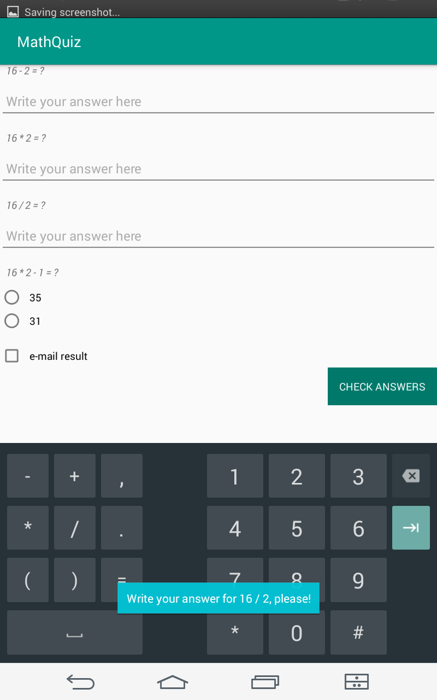
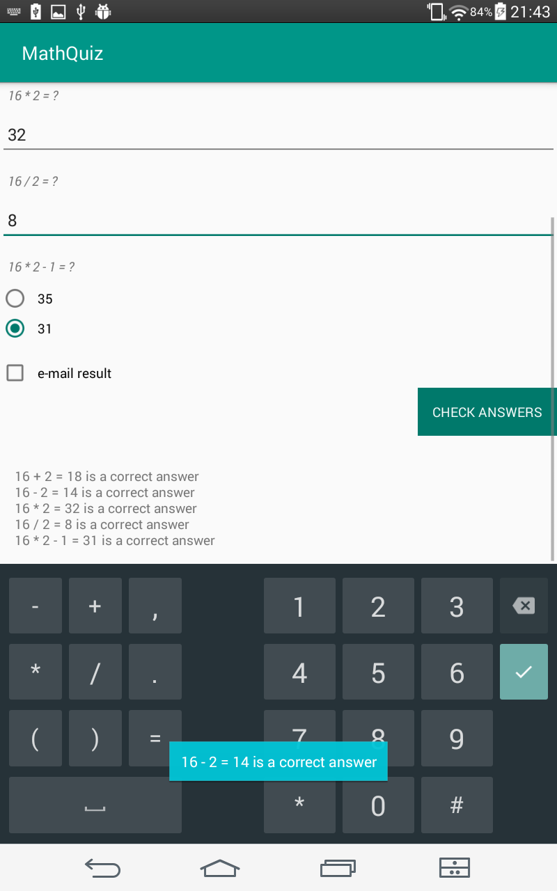

# Math Quiz

Fourth task from Udacity's [Android basics course](https://www.udacity.com/course/android-basics-nanodegree-by-google--nd803)

Android Basics: User Input

[Lesson 5: Project](https://review.udacity.com/#!/rubrics/158/view)

An app with a math quiz.

There are two digits generated using Math library.

User is given five problems

While there is any task that user hasn't wrote or chose answer to it wouldn't check if they are correct and say to user to write an answer to the problem.

When all answers are written and chosen app checks if answers are correct.

